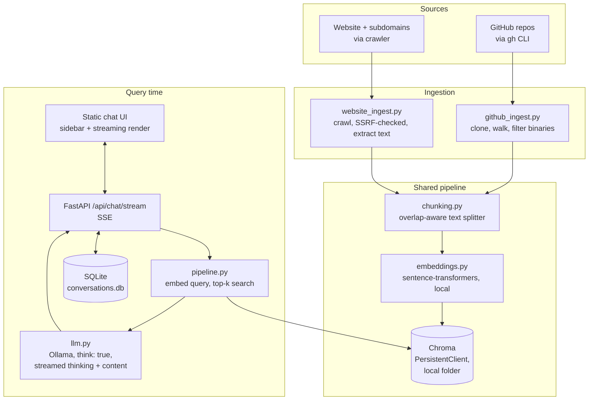

# System Architecture

## Overview

A local RAG pipeline with two independent ingestion sources feeding one shared vector store,
queried by a small FastAPI backend and a static chat UI. Every component runs on the local
machine; nothing is hosted or paid for.



## Components

| Component | File(s) | Responsibility |
|---|---|---|
| GitHub ingestion | `ingest/github_ingest.py` | Lists repos via `gh repo list`, shallow-clones each via `gh repo clone`, walks files (skipping binaries/build output/dependencies by content-sniffing + extension), chunks, embeds, upserts. Purges chunks for repos/files no longer present on each run. |
| Website ingestion | `ingest/website_ingest.py` | Discovers subdomains via crt.sh, crawls same-domain pages with SSRF protections (redirect re-validation, private-IP blocking, response-size caps) and `robots.txt` compliance, extracts readable text, chunks, embeds, upserts. Purges chunks for pages no longer reachable. |
| Chunking | `app/rag/chunking.py` | Character-based sliding window with overlap, breaking on line boundaries where possible. Dependency-free by design (no tokenizer library needed for "roughly token-sized" chunks). |
| Embeddings | `app/rag/embeddings.py` | Wraps a local `sentence-transformers` model (`BAAI/bge-small-en-v1.5` by default), cached as a singleton. Skips Hugging Face Hub's online freshness check once the model is confirmed cached, avoiding multi-minute hangs on a slow connection. |
| Vector store | `app/rag/vectorstore.py` | Thin wrapper over Chroma's embedded `PersistentClient` — a local folder, no server process, no network listener. Exposes `upsert`, `query`, `delete_where`, `list_metadatas`. |
| Retrieval + generation | `app/rag/pipeline.py`, `app/rag/llm.py` | Embeds the question, retrieves top-k chunks, builds a delimited `<context>` block, calls a local Ollama model (`think: true`) with a system prompt that treats retrieved content as untrusted data and requires citations. `llm.chat_stream()` yields `thinking`/`content` deltas as separate event types (Ollama exposes them as distinct fields when streaming, not `<think>` tags to scrape) plus prior conversation turns for continuity. |
| Conversation history | `app/store/db.py`, `app/store/conversations.py` | SQLite (`data/conversations.db`), a fresh short-lived connection per call rather than one shared connection -- sidesteps sqlite3's thread-affinity rules for a low-concurrency local tool. Two tables: `conversations` (id, title, timestamps) and `messages` (role, content, thinking, sources as JSON). Schema creation is idempotent on every connect, so it doesn't depend on an explicit init step running first. |
| API | `app/main.py` | FastAPI app: `/` serves the static chat UI, `/api/chat` answers questions non-streaming (input length-capped; used by scripts/tests), `/api/chat/stream` is the SSE endpoint the live UI uses -- streams thinking/content deltas, creates/persists the conversation and both messages, `/api/conversations*` is CRUD for chat history, `/api/health` reports index size. `Cache-Control: no-cache` on static assets so UI edits are always picked up. |
| UI | `app/static/` | Plain HTML/CSS/JS, no build step, no external font/icon library (inline SVG). Sidebar with persistent conversation history, live SSE-driven streaming with a collapsible thinking panel, custom modal dialogs (no native `prompt()`/`confirm()` -- see [TESTING.md](TESTING.md) for why that mattered). Renders all model/user content via `textContent`/`createElement`/an escape-first markdown renderer (never raw `innerHTML` from untrusted text) -- no XSS surface. |

## Data flow

```
SOURCE (GitHub repo file / web page)
  → INGESTION (clone or fetch, with safety checks)
  → CLEANING (binary detection, text extraction)
  → CHUNKING (overlap-aware splitting)
  → EMBEDDING (local sentence-transformers)
  → VECTOR DB (Chroma upsert, deterministic content-addressed IDs)
       ... later, at query time ...
  → RETRIEVAL (embed question, cosine top-k search)
  → CONTEXT CONSTRUCTION (numbered, delimited, cited)
  → LLM (local Ollama, system-prompted to cite and abstain honestly)
  → RESPONSE (answer + clickable source links)
```

## Why these choices

- **`gh` CLI instead of a raw GitHub token in code**: one less credential this project ever
  handles directly; relies entirely on credentials the user already manages via `gh auth
  login`.
- **Chroma `PersistentClient`, not a Chroma server**: an embedded, file-backed client has no
  network listener at all, so a class of known Chroma CVEs (its HTTP server's
  `trust_remote_code` code-injection and multi-tenant RBAC bugs — see
  [TESTING.md](TESTING.md) §5) simply isn't reachable here.
- **Deterministic, content-addressed chunk IDs** (`sha256(repo:path:chunk_index)` or
  `sha256(url:chunk_index)`): makes ingestion idempotent (`upsert`, not `insert`) and makes
  stale-data purging possible — diff the current run's IDs against what's stored, delete the
  difference. See the "Data freshness" fixes in [TESTING.md](TESTING.md) §1 findings #4.
- **No auth layer**: this is a single-user, localhost-only tool by design (see
  [IDEA.md](IDEA.md)). Binding to `127.0.0.1` and never adding multi-user
  auth/rate-limiting is a deliberate scope boundary, not an oversight — documented explicitly
  in the README and in the audit's N/A section rather than left ambiguous.
- **SQLite for conversation history, not another Chroma collection or a JSON file**: chat
  history is relational (a conversation has many ordered messages) and needs simple filtering
  (list by recency) — SQLite is the built-in, zero-dependency tool for exactly that, and
  keeping it separate from the knowledge-base vector store keeps each store's job singular.
- **Server-Sent Events, not WebSockets, for streaming**: the traffic is one-directional
  (server → client, per request) and short-lived — SSE is the simpler primitive for that
  shape and needs nothing beyond a `fetch()` + `ReadableStream` on the client, no extra
  library or connection-lifecycle management.

## What's intentionally not here

- **Reranking / hybrid BM25+vector search** — plain top-k dense retrieval was good enough for
  this scale (a few thousand chunks); adding a reranker is a real but non-trivial future
  improvement, not implemented because it wasn't needed yet.
- **GitHub Issues/PRs/commit-history ingestion** — only default-branch file contents are
  indexed. Issue/PR text is the most attacker-reachable content on a public repo, so leaving
  it out also shrinks the prompt-injection attack surface.
- **Docker/CI/CD** — a personal local tool doesn't need a deployment pipeline it will never
  use.
